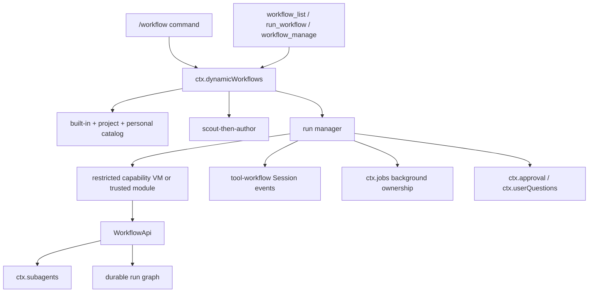

# Architecture

## Position in DSH

The plugin adds `ctx.dynamicWorkflows` above existing DSH seams. It does not modify the agent loop and does not replace `ctx.workflows`.

## Components

- `capsule.ts`: strict capsule, manifest, requirement, and input-schema validation.
- `source-policy.ts`: static effect policy and quality lint.
- `runtime.ts`: isolated QuickJS/WASM JSON capability bridge, deterministic globals, CPU/wall/memory/stack limits, and bridge shutdown.
- `catalog.ts`: deterministic discovery, trusted-local loading, atomic save/archive/rename/delete.
- `author.ts`: read-only scout, structured author, bounded repair and provenance.
- `engine.ts`: preflight, approval, run state, subagent routing, budgets, pause/resume/stop, nesting, cache, events, adapters.
- `store.ts`: run snapshots, append-only events, capsule snapshots, cache, artifacts, retention and identity.
- `service.ts`: per-project engine/store ownership and user/model lifecycle operations.
- `index.ts`: Cordis config, three tools, command and system-prompt integration.

## Important invariants

1. A capability-generated script cannot obtain a host object; every crossing is detached JSON.
2. A task handle is returned only after `ctx.subagents.start()` publishes the child.
3. Every published native agent-start edge has exactly one native agent-end edge.
4. Every published child produces an explicit completed/completed-unverified/failed/stopped AgentResult; run-control failures still propagate.
5. Pause blocks tasks that are not yet published, including tasks already queued on the semaphore.
6. Run-id reruns execute the immutable snapshot; saved-name reruns execute the current catalog entry.
7. A trusted-local module is imported only after an explicit grant.
8. Provider/model/isolation/verification fields are never accepted and ignored.
9. The deployment semaphore is shared by all runs and project engines owned by one service.
10. Cordis unload aborts and awaits every active run before the service fiber finishes disposal.
11. Required structured output is accepted only after schema validation; at most one same-route, tool-free format repair may replace a missing or invalid capture.

## Why a separate engine

DSH's native worker workflow is deliberately a bounded foreground script seam. KodaX parity additionally requires named catalogs, trusted-local approval, durable task handles, live messaging, process pause/resume, nesting, artifacts, cost records, snapshot rerun and cache resume. Those responsibilities belong in an additive service above `ctx.subagents`, leaving the native engine small and unchanged.
